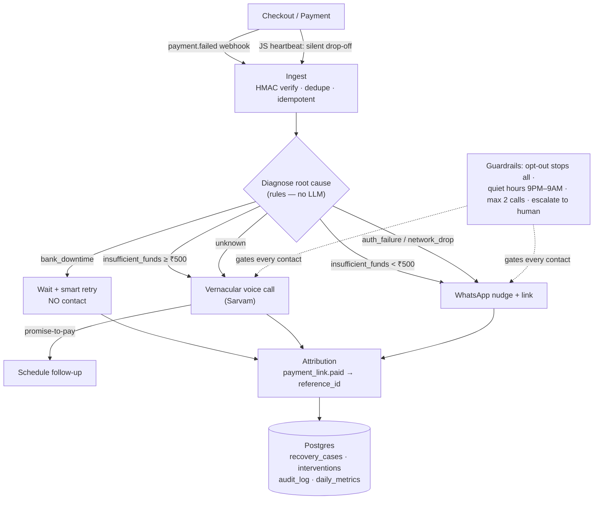

# Retry — AI Revenue Recovery

> **वसूली / వసూలు** — "recovery." An agent that plugs into a Razorpay merchant's checkout, catches every failed and silently-abandoned payment, **diagnoses *why* it failed before it acts**, and recovers the money with the lightest touch that works — smart retries, a WhatsApp nudge, or a **vernacular Telugu/Hindi/English voice call**. Every rupee is measured; every action is audited.

*Razorpay AI Buildathon 2026 · Track 03: AI Revenue Recovery*

---

## The result first (money slide)

Measured across a **105-case batch** (15 merchants, **₹2,01,765 at risk**), running three recovery policies over the *same* cases:

| Policy | ₹ recovered | recovery rate | customer contacts | cost / recovery |
|---|---:|---:|---:|---:|
| Baseline — blind retries only | ₹74,184 | 32.4% | 0 | ₹0 |
| Naive dunning — contact everyone | ₹93,201 | 42.9% | 105 | ₹1 |
| **Retry — diagnose first** | **₹1,12,929** | **61.0%** | **71** | **₹1** |

- **1.52× more recovered than baseline**, and ~21% more than a contact-everyone dunning tool.
- **34 fewer customer contacts than naive dunning (32.4% fewer)** — Retry recovers *more money while bothering fewer people*, because it never chases cases that will self-resolve.
- Rules-based diagnosis is **90.5% accurate** vs ground truth. Promise-to-pay: **14 captured, 10 kept (71%)**.

> **These numbers are simulated** on a synthetic batch with an India-realistic failure mix, using a documented recovery model (see [Measurement & honesty](#measurement--honesty)). The point is a defensible, reproducible batch result — not a claim of production numbers. The live demo then recovers **one real Razorpay test payment link on camera** to prove the plumbing is real. Reproduce the table with `node retry-harness/runExperiment.mjs` (deterministic, seed `20260830`).

---

## The problem

In India, a large share of checkout failures have **nothing to do with the customer not wanting to pay**. They break down roughly like this:

| Root cause | Share | What actually happened |
|---|---:|---|
| Bank / gateway downtime | ~35% | The bank's rails were down for a few minutes. The customer did nothing wrong. |
| Insufficient funds | ~25% | Money isn't in the account *right now* — often a timing problem, not an intent problem. |
| Auth failure (wrong OTP/PIN, 3DS) | ~20% | A fixable UX stumble. |
| Network drop / silent abandonment | ~15% | The customer got most of the way there, then the page died or they got distracted. |
| Other / unknown | ~5% | — |

Existing recovery tools treat all of these the same way: **retry blindly, or message everyone the moment a payment fails.** That's the wrong move in India. Blasting a "your payment failed!" message at a customer during a *bank outage* recovers nothing, costs money, and annoys someone who did nothing wrong. And almost none of these tools speak the customer's language on a channel they'll actually answer.

**Retry's bet: the winning move is to diagnose first, then match the intervention to the cause — and sometimes the right intervention is to do nothing but wait and retry.**

---

## What Retry does differently

1. **Diagnosis before contact.** Every failure is classified into a root cause from its decline code and downtime signals *before* any customer is contacted. If it's bank downtime, Retry **waits and retries and never calls** — because those cases self-resolve once the rails recover. This single decision is why Retry recovers more while contacting fewer people.
2. **Vernacular voice recovery.** For high-value, high-intent cases, Retry places a real **Telugu / Hindi / English voice call** (via Sarvam), holds a natural conversation, captures a promise-to-pay, and sends a fresh payment link. This is a channel Indian customers actually pick up — and it's genuinely impossible to do with rules alone.
3. **Silent drop-off detection.** A lightweight JS heartbeat on the checkout catches customers who abandon *without* a failure event ever firing — the invisible leak most tools never see.

---

## How it works



A failed or abandoned payment becomes a **recovery case**. The case moves through a small, explicit state machine — `detected → diagnosed → intervening → (recovered | promised | escalated | closed_lost)` — and every transition, with the agent's reasoning, is written to an append-only `audit_log`.

---

## AI judgment: where the LLM belongs (and where it doesn't)

Track 03 rewards using AI where it genuinely helps and *penalizes* forcing an LLM where rules are better. Retry draws that line deliberately:

| Deterministic — **no LLM** | AI — where it's the only thing that works |
|---|---|
| Decline-code → root-cause mapping | The open-ended **voice conversation** (real NLU across Telugu / Hindi / English) |
| Downtime correlation | **Transcript → structured outcome** (promise-to-pay, objection, callback time from messy speech) |
| The entire policy / guardrail engine | Drafting WhatsApp copy in the right language and tone |
| Retry scheduling · attribution matching | |

**The money math and the safety policy are deterministic and auditable. AI is confined to the natural-language surface where rules cannot compete.** An LLM in the policy path would only add nondeterminism and risk — so it isn't there.

---

## Guardrails (safety & compliance)

- **Opt-out is absolute** — one request stops every future contact, checked before any outreach.
- **Quiet hours** — no calls or messages 9 PM–9 AM local time.
- **Max 2 calls** per case, then automatic **escalation to a human**.
- **HMAC signature verification** on every inbound webhook; mismatches are rejected and audited.
- Designed around **TRAI / DND** realities: the merchant has an existing customer relationship, contact is bounded, and consent is honored.

---

## Failure recovery (graceful degradation)

The system is built to bend, not break. Handled and demonstrated:

- **Malformed webhook payload** → routed to a `needs_review` sink; the pipeline keeps running.
- **Duplicate webhook** (unique event id) → deduped; no double-case, no double-charge.
- **Unknown decline code** → `root_cause = unknown` → safe default; never crashes.
- **WhatsApp send fails / template not yet approved** → fall back to retry-only, log, continue.
- **Voice call times out / no answer** → increment attempt count to the cap, then escalate.
- **HMAC mismatch** → reject and audit.

The harness injects duplicate and malformed events on every run: in the last run, **1 duplicate deduped, malformed events routed to `needs_review`, 0 crashes.**

---

## How Retry compares

*Category-level comparison — verify specific vendor features before citing individual names in the panel.*

| | Subscription-dunning tools (e.g. Chargebee, Recurly, Churn Buster) | PSP built-in retries (e.g. Stripe Smart Retries, Razorpay retries) | **Retry** |
|---|:--:|:--:|:--:|
| Recovers **one-time** (non-subscription) failures | Limited | Partial | ✅ |
| **Diagnoses root cause** before contacting | ✗ | ✗ | ✅ |
| **Skips contact** when it's bank downtime | ✗ | n/a | ✅ |
| **Vernacular voice** (Telugu / Hindi) | ✗ | ✗ | ✅ |
| India rails / downtime aware | ✗ | Partial | ✅ |
| Per-action **audit trail with reasoning** | Partial | ✗ | ✅ |

The wedge: existing tools are built for **subscription churn in Western markets over email/SMS**. Retry is built for **one-time and recurring payment failure in India**, where the dominant failure mode is transient rails/timing problems and the winning channel is a vernacular voice call.

---

## Tech stack

- **App:** Next.js (checkout snippet + merchant dashboard + webhook + agent API routes)
- **Data:** Postgres (InsForge) — `recovery_cases`, `interventions`, `call_sessions`, `promises`, `audit_log`, `daily_metrics`
- **Payments:** Razorpay test-mode APIs (webhooks, payment links)
- **Messaging:** WhatsApp Cloud API (utility templates)
- **Voice:** Sarvam vernacular voice agents
- **Measurement:** zero-dependency Node (`retry-harness/`)

---

## Repo layout & running it

```
retry/
├── README.md                     ← you are here
├── Retry_Selection_Review.md   ← strategy, panel Q&A, de-risked plan
└── retry-harness/              ← the measurement harness (zero deps)
    ├── runExperiment.mjs
    ├── README.md
    └── out/                      ← results.json · audit_log.csv · money_slide.md
```

Reproduce the money slide (Node 18+, no `npm install`):

```bash
cd retry-harness
node runExperiment.mjs
```

---

## Measurement & honesty

The batch numbers are **simulated**, and that is a deliberate, defensible choice — Track 03 asks for *money recovered measured across a batch*, and a transparent model over 100+ cases beats one cherry-picked live recovery.

- Each root cause has a documented recovery probability under three arms — **baseline** (blind retries), **naive dunning** (contact everyone), **Retry** (diagnose-first). Every probability is a named constant with a rationale in `runExperiment.mjs`.
- The comparison is **paired**: all three policies run over the *same* cases with the *same* latent recoverability draw, so differences come from policy, not luck.
- **Determinism** (fixed seed) means anyone can reproduce the exact numbers above.
- **Sensitivity:** even if the Retry recovery advantage is overstated by 20%, the contacts-avoided and cost-per-recovery advantages still hold — the structural win (not chasing self-resolving cases) doesn't depend on the exact probabilities.

The live integrations run on **Razorpay test-mode** and recover a **real test payment link on camera** — proving the pipeline is real, while the harness proves the policy scales.

---

## What's real in this submission

> Fill this in as you complete each piece — judges value an honest status box far more than an inflated one.

- ✅ **Measurement harness** — runs, produces the money slide, injects failures, writes an audit log.
- ✅ **Deterministic diagnosis + bounded policy engine** — implemented and exercised by the harness.
- ⬜ **Live Razorpay test payment-link recovery** — recorded on camera.
- ⬜ **Live WhatsApp send** (happy path) — fallback: queued message + template shown.
- ⬜ **Live Sarvam Telugu call** — fallback: pre-recorded, clearly labelled clip.
- ⬜ **Merchant dashboard** — fallback: renders from static harness output.

---

## Roadmap

Recovery is one agent in a larger surface. Next: a **Track-2 crossover** that turns `payment.dispute.created` events into auto-assembled chargeback evidence, broader rails (UPI-autopay, cards, netbanking) in the retry engine, and telephony hardening for the voice channel.

---

*Built solo for the Razorpay AI Buildathon 2026. Code speaks louder than a résumé — so every claim here is reproducible from this repo.*

## Production Deployment Checklist

Before deploying to Vercel or your preferred host, ensure the following steps are complete:

1. **Environment Variables:**
   - Configure `NEXT_PUBLIC_APP_URL` to your production domain.
   - Add all `RAZORPAY_*` credentials (`RAZORPAY_KEY_ID`, `RAZORPAY_KEY_SECRET`, `RAZORPAY_WEBHOOK_SECRET`).
   - Add `SARVAM_API_KEY`, `SARVAM_AGENT_ID`, and `SARVAM_WEBHOOK_SECRET` with live values.
   - Set `DEMO_MODE=false`, `SARVAM_MOCK_MODE=false`.
2. **Razorpay Webhooks:**
   - Add your production URL `https://<domain>/api/webhooks/razorpay` to your Razorpay dashboard.
   - Subscribe to `payment.failed`, `payment_link.paid`, etc.
3. **Sarvam Callback URL:**
   - Register `https://<domain>/api/webhooks/sarvam` in your Sarvam agent settings.
4. **Test the Live Flow:**
   - Run a test failure in Razorpay test mode first and verify Sarvam initiates a live outbound call to a designated test number.
5. **Limitations:**
   - WhatsApp is intentionally omitted in this build.
   - Do not use for non-INR currencies without modifying the `formatCurrency` logic.

## Known limitations
- **Razorpay test mode only**: Production credentials are not supported without explicit webhook configuration.
- **Sarvam mock mode by default**: Outbound-call provider values require manual dashboard configuration to execute live HTTP requests.
- **No WhatsApp/SMS integration yet**: The `payment_link_follow_up` intervention serves as the baseline alternative to messaging.
- **Synthetic evaluation data**: The workspace is preloaded with 100 deterministic mock cases, not production merchant results.
